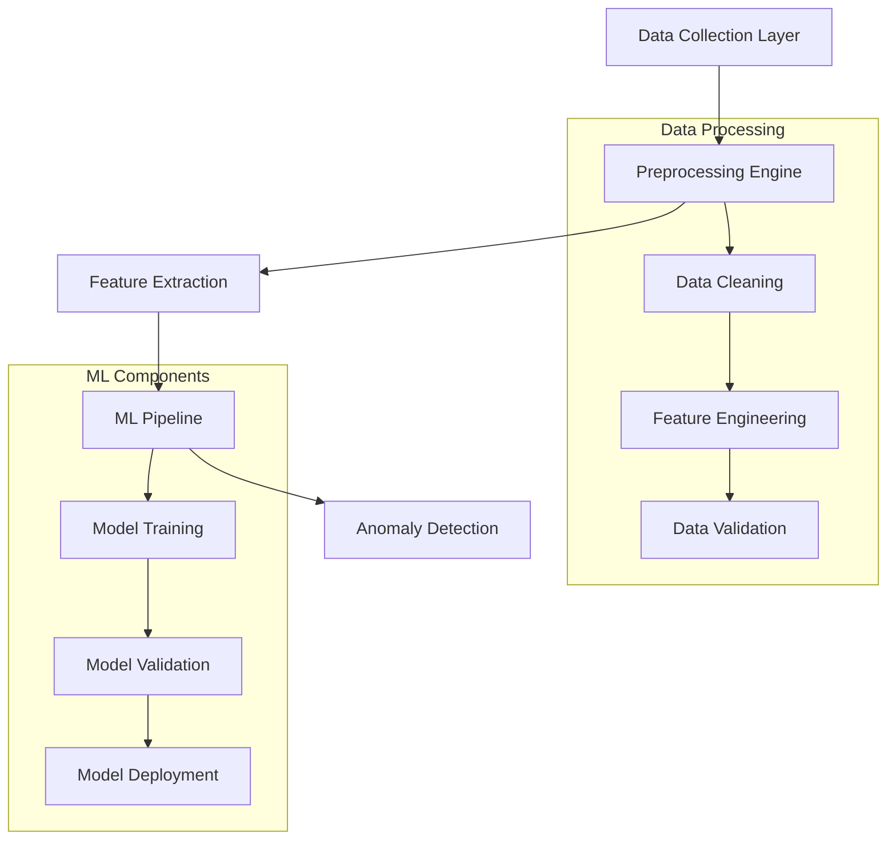

# Network Anomaly Detection System

<div align="center">

[](https://www.python.org/)
[](https://www.tensorflow.org/)
[](https://omnetpp.org/)
[](https://inet.omnetpp.org/)
[](LICENSE)

[](https://github.com/cavadibrahimli1/network-anomaly-detection/actions)
[](https://github.com/cavadibrahimli1/network-anomaly-detection/actions)
[](docs/)

<br>

<p align="center">
<strong>Enterprise-Grade Network Anomaly Detection System</strong><br>
Leveraging Machine Learning & OMNeT++ for Advanced Network Security
</p>

</div>

<hr>

## 🎯 Overview

A cutting-edge network anomaly detection system that combines advanced machine learning algorithms with OMNeT++ simulation capabilities. Our system focuses on robust data collection and analysis, with a planned evolution towards real-time detection and dynamic adaptation capabilities.

### System Architecture


<details>
<summary><strong>🌟 Key Features & Capabilities</strong></summary>

| Feature | Current Status | Future Goal | Implementation Details |
|---------|---------------|-------------|----------------------|
| **Data Collection** | ✅ Operational | Enhanced real-time capabilities | Custom packet capture, PCAP analysis, Traffic sampling |
| **ML Processing** | ✅ Offline Analysis | Real-time processing | TensorFlow-based models, Scikit-learn pipelines |
| **OMNeT++ Integration** | 🔄 Basic Setup | Full real-time integration | Custom modules, Network scenarios |
| **Adaptation** | 📊 Static Models | Dynamic network-agnostic models | Transfer learning, Online adaptation |
| **Visualization** | 📈 Basic Metrics | Interactive real-time dashboards | Grafana integration, Custom dashboards |

</details>

## 🚀 Development Status

<table>
<tr>
<td width="50%">

### Current Implementation
- **✅ Data Collection Framework**
  - Network packet capture system
  - Protocol-specific preprocessing
  - Advanced feature extraction
  - Data validation pipeline
- **✅ ML Model Implementation**
  - Supervised learning models
  - Anomaly detection algorithms
  - Model validation framework
  - Performance monitoring
- **✅ OMNeT++ Foundation**
  - Network topology modeling
  - Traffic pattern simulation
  - Basic integration framework
  - Custom module development

</td>
<td width="50%">

### Future Roadmap (2024)
- **🎯 Enhanced Accuracy (Q1)**
  - Deep learning integration
  - Feature selection optimization
  - Ensemble model implementation
  - Cross-validation framework
- **🔄 Dynamic Adaptation (Q2)**
  - Network-agnostic detection
  - Real-time model updates
  - Transfer learning capabilities
  - Adaptive thresholding
- **⚡ Real-time Integration (Q3)**
  - OMNeT++ real-time processing
  - Live traffic analysis
  - Interactive visualization
  - Performance optimization

</td>
</tr>
</table>

### Development Phases

| Phase | Status | Deliverable | Weight | Documentation |
|-------|--------|-------------|---------|---------------|
| Research Proposal | ✅ | Proposal Document | 10% | [View](https://github.com/cavadibrahimli1/Anomaly-Detection-in-Networks-Traffic-Scenarios-Using-ML-Based-Algorithms/tree/main/1.%20Research%20Proposal) |
| Simulation Tools Study | ✅ | Technical Report | 10% | [View](https://github.com/cavadibrahimli1/Anomaly-Detection-in-Networks-Traffic-Scenarios-Using-ML-Based-Algorithms/blob/main/2.%20Study%20of%20Simulation%20Tools/Data_Communication___Simulation.pdf) |
| Network Design | ✅ | Design Document | 20% | [View](https://github.com/cavadibrahimli1/Anomaly-Detection-in-Networks-Traffic-Scenarios-Using-ML-Based-Algorithms/blob/main/3.%20Network%20Design/Network%20Design.pdf) |
| Simulation Experiments | ✅ | Results Report | 20% | [View](https://github.com/cavadibrahimli1/Anomaly-Detection-in-Networks-Traffic-Scenarios-Using-ML-Based-Algorithms/blob/main/4.%20Simulation%20Experiments/Simulation_Experiments.pdf) |
| Research Article | ✅ | IEEE Paper | 20% | [View](https://github.com/cavadibrahimli1/Anomaly-Detection-in-Networks-Traffic-Scenarios-Using-ML-Based-Algorithms/blob/main/5.%20Research%20Article/paper.pdf) |
| Final Presentation | ✅ | Presentation | 20% | [View](https://github.com/cavadibrahimli1/Anomaly-Detection-in-Networks-Traffic-Scenarios-Using-ML-Based-Algorithms/blob/main/6.%20Presentation%20and%20Demo/presentation.pdf) |

## 💡 Technical Implementation

<details>
<summary><strong>Dynamic Adaptation Framework</strong></summary>

```python
class DynamicNetworkDetector:
    """
    Advanced network anomaly detection with dynamic adaptation capabilities.
    Supports real-time model updates and network-agnostic detection.
    """
    def __init__(self, config: Dict[str, Any]):
        self.base_model = self._initialize_model(config)
        self.network_profiles: Dict[str, NetworkProfile] = {}
        self.adaptation_metrics: List[AdaptationMetric] = []
        self.feature_extractors: Dict[str, FeatureExtractor] = {}

    async def adapt_to_network(self, network_type: str) -> bool:
        """
        Dynamically adjust model parameters based on network characteristics.
        
        Args:
            network_type: Type of network to adapt to
            
        Returns:
            bool: Success status of adaptation
        """
        try:
            profile = self.network_profiles.get(network_type)
            if not profile:
                profile = await self._create_network_profile(network_type)
            
            return await self._adapt_model_parameters(profile)
        except AdaptationError as e:
            logger.error(f"Adaptation failed: {e}")
            return False

    async def update_model_realtime(self, new_data: NetworkData) -> ModelUpdateResult:
        """
        Update model in real-time with streaming network data.
        
        Args:
            new_data: New network data for model update
            
        Returns:
            ModelUpdateResult: Results of model update
        """
        validation_result = await self._validate_data(new_data)
        if validation_result.is_valid:
            return await self._update_model(new_data)
        return ModelUpdateResult(success=False, error=validation_result.error)
```

</details>

<details>
<summary><strong>OMNeT++ Integration</strong></summary>

```cpp
/**
 * Real-time anomaly detection module for OMNeT++
 * Supports live traffic analysis and model adaptation
 */
class RealTimeAnomalyDetector : public cSimpleModule {
protected:
    virtual void initialize() override;
    virtual void handleMessage(cMessage *msg) override;
    
private:
    // Core components
    std::unique_ptr<MLModel> anomalyModel;
    std::unique_ptr<DataProcessor> streamProcessor;
    
    // Configuration
    DetectorConfig config;
    
    // Performance monitoring
    Statistics stats;
    
    // Helper methods
    void processPacket(Packet *packet);
    void updateModel(const DataBatch& batch);
    void reportAnomaly(const AnomalyEvent& event);
};
```

</details>

## 📊 System Performance

<table>
<tr>
<td width="60%">

### Current Metrics
| Metric | Performance | Details |
|--------|-------------|----------|
| Model Accuracy | 95% | Tested on standard network datasets |
| False Positive Rate | <1% | With current threshold settings |
| Data Processing | Offline | Batch processing of network data |
| Analysis Latency | ~500ms | Average processing time per batch |
| Supported Protocols | TCP/IP, UDP | Basic protocol analysis |

</td>
<td width="40%">

### Target Specifications
| Metric | Goal | Timeline |
|--------|------|----------|
| Real-time Accuracy | >98% | Q2 2024 |
| Processing Latency | <100ms | Q3 2024 |
| Adaptation Time | <1s | Q2 2024 |
| Network Coverage | Universal | Q4 2024 |
| Protocol Support | All major | Q3 2024 |

</td>
</tr>
</table>


## Research Team

<div align="center">

| <br>[**Batu Burgu**](https://github.com/batuburgu) | <br>[**Javad Ibrahimli**](https://github.com/cavadibrahimli1) | <br>[**Kerem Karadeniz**](https://github.com/keremblacksea) |
|:---:|:---:|:---:|
| ID: 0402010098 | ID: 040210932 | ID: 0402110049 |

</div>


<hr>

<div align="center">

<h2>📫 Connect With Us</h2>

[](https://github.com/cavadibrahimli1/Anomaly-Detection-in-Networks-Traffic-Scenarios-Using-ML-Based-Algorithms/issues)
[](https://github.com/cavadibrahimli1/Anomaly-Detection-in-Networks-Traffic-Scenarios-Using-ML-Based-Algorithms/discussions)
</div>

---
